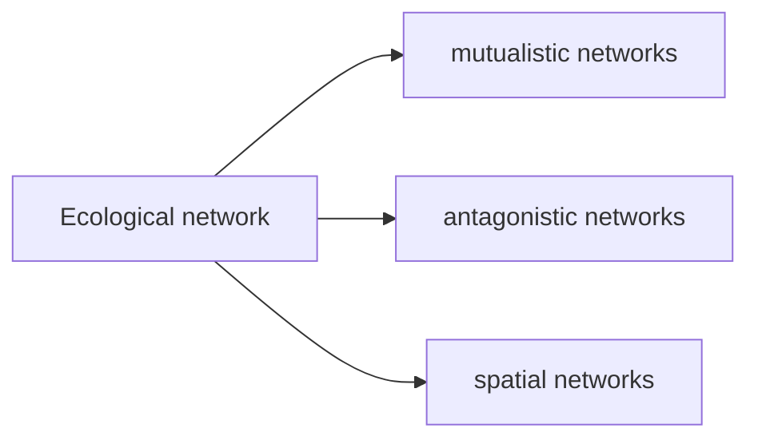

$$
\begin{align*}

\end{align*}
$$

[TOC]

$g$ 可以表示邻接矩阵，也可以表示权重矩阵  

Geodesic: a shortest path between two nodes    

Matrix $g$  : number of walks of length 1 from $i$ to $j$      

$g^2$ : number of walks of length 2 from $i$ to $j$       

$(N, g)$ is **connected**: there is a link between **every** two nodes (we don’t ask for direct bipartite links)      

Component: <u>maximal</u> <u>connected</u> subgraph; it is connected, and it needs to include all the related nodes in the “bigger graph” ; single node is a component       

######  Diameter& Average path length

- How close are nodes
- How long does it take to reach average node
- How fast will information spread

Diameter: count links, not nodes           

记树的根结点为水平$0$ ，则一棵完全树到第$K$ 水平一共有$2^0+2^1+\cdots+2^K$ 个节点 (化简之后为$\frac{1\cdot (1-2^{K+1})}{1-2}=2^{K+1}-1$ 个节点)，反解得$K=\log_2(n+1)-1$ 。由于直径是最长的geodesic，即第$K$ 水平最左节点到最右节点之间的最短路径，为沿着树枝通过根结点的路径，从最左叶子到根结点的路径长度为$K$ ，所以直径为$2K$       

循环图的直径为两个节点之间最长的最短距离，为$\frac{n}{2}$ 或 $\frac{n-1}{2}$                                 

Erdos-Renyi Graph: serve as a benchmark $G(n,p)$     

- Links are dense so that the network is connected almost surely                  
  $$
  d(n) \geq(1+\varepsilon) \log (n)
  $$

- At the same time, network is not too complete         
  $$
  d(n)/n\to 0
  $$
  

`Thm:` 

> 如果满足上述两个条件，那么对于足够大的$n$ ,平均路径长度除以直径近似与$\log(n)/\log(d)$ 成正比。

二项到泊松的连接桥梁：
$$
\lim\limits_{x/n\to0} (1-x / n)^{n}=e^{-x}
$$
Probability of degrees: based on Chernoff bound     

`Probability that node has degree close to average: `          

$$
\operatorname{Pr}\left(\mathrm{d} / 3 \leq \mathrm{d}_{\mathrm{i}} \leq 3 \mathrm{d}\right) \geq 1-\mathrm{e}^{-\mathrm{d}}
$$

$$
\operatorname{Pr}(\mathrm{d} / 3 \leq \text { all degrees } \leq 3 \mathrm{d}) \geq\left(1-\mathrm{e}^{-\mathrm{d}}\right)^{\mathrm{n}}
$$

Distribution of links per node: **Fat tails** 

###### Scale Free Distribution

$$
P(d)=c d^{-a}
$$

###### Clustering

用$N_i(g)$ 表示网络$g$ 中节点$i$ 的邻居，则聚类定义为

$$
\mathrm{Cl}_{\mathrm{i}}(\mathrm{g})=\#\left\{\mathrm{kj} \text { in } \mathrm{g} \mid \mathrm{k}, \mathrm{j} \text { in } \mathrm{N}_{\mathrm{i}}(\mathrm{g})\right\} / \#\left\{\mathrm{kj} \mid \mathrm{k}, \mathrm{j} \text { in } \mathrm{N}_{\mathrm{i}}(\mathrm{g})\right\}
$$

*“ What fraction of my friends are friends of each other? ”*       

Overall clustering:    

​      
$$
\mathrm{Cl}(\mathrm{g})=\Sigma_{i} \#\left\{\mathrm{kj} \text { in } \mathrm{g} \mid \mathrm{k}, \mathrm{j} \text { in } \mathrm{N}_{i}(\mathrm{g})\right\} / \Sigma_{i} \#\left\{\mathrm{kj} \mid \mathrm{k}, \mathrm{j} \text { in } \mathrm{N}_{i}(\mathrm{g}) \right\}
$$

Many observed social networks are more clustered than world arise at random          

$n$ 个节点能形成多少种网络(不考虑有向无向，只考虑边)      

$n$ 个节点之间有 $n(n-1)/2$ 条边， 每条边都可能存在或不存在，所以有$2^{\wedge}(n(n-1) / 2)$ 种不同的网络结构      

Define a network’s complement $(N,g')$ : $(ij\in g')$ if and only if $(ij \not\in g)$     

- If a network is connected and not complete, than its complement is nonempty;

- The complement of of a complete network is an empty network, which is not connected

- There is a network such that both itself and its complement are connected:

  Consider $N=\{1,2,3,4\}$ , $g=\{12,23,34\}$ $g'=\{13,24,14\}$              

**Degree centrality**: $\frac{\text{Degree}}{n-1}$ (rememeber to minus 1!)           

Four different things to measure:

- Degree-connect
- Closeness, Decay -easeof reaching other nodes
- Betweenness-role as an intermediary, connector
- Influence, Prestige, Eigenvectors-who you knows 

**Closeness centrality**: $\frac{(n-1)}{\sum_{j} \text{I}(i, j)}$ , $I(i,j)$ **means the shortest path between node $i$ and node $j$**                    

Closeness centrality represents the relative distance to other nodes , and it is scaled directly with distance: twice as far means half as central        

​      

**Decay centrality** : $C_{i}^{d}(g)=\sum_{j \neq i} \delta^{\text{I}(i, j)}$    

 When $\delta$ nears 1, it becomes component size; when $\delta$ nears 0, it becomes degree  centrality; $\delta$ in between 0 and 1 represents a decaying distance measure: weights distance exponentially            

Normalized decay centrality: $C_{i}^{d}(g)=\sum_{j \neq i} \delta^{\text{I}(i, j)} /((n-1) \delta)$ , $(n-1)\delta$ is the lowest decay possible (since $\delta\in[0,1]$ ,$\delta^n<\delta$, I think it is the possible highest decay?)         

​    

**Betweenness centrality** : $\frac{\Sigma_{\mathrm{i}, j \neq k}\left[\mathrm{P}_{\mathrm{k}}(\mathrm{i}, \mathrm{j}) / \mathrm{P}(\mathrm{i}, \mathrm{j})\right]}{[(\mathrm{n}-1)(\mathrm{n}-2) / 2]}  $     

$P(i,j)$ :number of geodesic between $i$ and $j$          

$P_k(i,j)$ :number of geodesic between $i$ and $j$ that $k$ lies on         

**Eigenvector centrality** : $C_i=a\sum_{\text{j}}g_{ij}C_j$ , $g_{ij}=\text{I}(j\in N_{i}(g))$                 (A self-referential concept)

  Matrix form: $C=agC$ $\Rightarrow$ eigenvector                

  Use eigenvector centrality, one can distinguishes more “influential” nodes            

  Google page rank: score of a page is proportional to the sum of the scores of pages linked to it         

**Bonacich centrality** : $C^{b}(g)=a g\textbf{1}+b g a g\textbf{1}+b^{2} g^{2} a g\textbf{1}+ \ldots$        

1. give each node a base value $a\cdot d_i(g)$ (const times degree, $a>0$ )             
2. add in all paths of length 1 from i to some j times $b$ times j’s base value
3. add in all walks of length 2 from i to some j times $b^2$ times j’s base value                  
4. ......      

**Diffusion centrality** : $\text{DC}_i(p,T)$ the number of nodes are informed after T periods if node $i$ is initially informed and each informed node has prob $p$ to tell each of its neighbors in each period          

$\mathrm{DC}(\mathrm{p}, \mathrm{T})=\sum_{\mathrm{t}=1 \ldots \mathrm{T}} (\mathrm{pg})^{\mathrm{t}} \textbf{1}$            

- If $p<1 / \lambda_{1}$ and $T$ is large, it becomes Bonacich centrality      
- If $p>1 / \lambda_{1}$ and $T$ is large, it becomes eigenvector centrality            

##### Random Network  

Monotone properties: A property $A(N)$ is monotone, if $g$ is in $A(N)$ and $g$ subset $g'$ implies $g'$ in $A(N)$       

Limiting properties: In order to deduce things about random networks, we often look at large networks, by examing limits         

Threshold function: $t(n)$ is a threshold function for a monotone property $A(N)$     

- If $\frac{p(n)}{t(n)}\to\infty$ , $P(A(N)\mid p(n)) \to 1$   
- If $\frac{p(n)}{t(n)}\to0$ , $P(A(N)\mid p(n)) \to 0$      

We say that a phrase transition occurs at $t(n)$        

`Example-Threshold for random networks:`            

1.  $\frac{1}{n^2}$ -the network has some links (average degree $\frac{1}{n}$)      
2. $\frac{1}{n^{\frac{3}{2}}}$ -the network has a component with at least three links    
3. $\frac{1}{n}$ -the network has a cycle, the network has a unique giant component, a component with at least $n^a$ ($a<1$) nodes (average degree 1)          
4. $\frac{\log(n)}{n}$ -the network is connected (average degree $\log(n)$)              

###### Growing Random Networks    

​                                          “Natural way of varying degree distributions” 

Each date a new node is born, it forms $m$ links to existing nodes and each node is chosen with equal likelihood             

Steps:   

- Start with $m$ nodes fully connected       
- New node forms $m$ links to existing nodes      
- An existing node has a probability $\frac{m}{t}$ of getting new link each period    

Expected degree for node $i$ born at $m<i<t$ is $m+\frac{m}{i+1}+\frac{m}{i+2}+\cdots+\frac{m}{t}\approx m(1+\log(\frac{t}{i}))$              

Nodes that have expected degree less than $d$ at time $t$ are $i>t e^{1-\frac{d}{m}}$        

$$
F_t(d)=\frac{t-t e^{1-\frac{d}{m}}}{t}=1-e^{1-\frac{d}{m}}
$$

$\Rightarrow$ Distribution of expected degree is such that $d-m$ is exponentially distributed with mean $m$ $F(d)=1-e^{-\lambda d}=1-e^{-\frac{d-m}{m}}$ , treat $\lambda=\frac{1}{m}$ and then you can see the distribution        

At time $t$ ,  $t*m$ links are formed, and there are $2*t*m$ total degrees. (cuz each link is counted twice in total degree)             

###### Mean field approximations

Continuous time approcimation: 

$$
d_i(i)=m\qquad(\text{Starting condition})\\
\frac{dd_i(t)}{dt}=\frac{m}{t}\qquad (\text{New links gained per unit time})
$$

$\Rightarrow$ $d_i(t)=m+m\log(\frac{t}{i})$              

###### Preferential attachment

Power law explanantion: Rich get richer- growth of existing object is proportional to size         

“Forms links with probability proportional to number of links a node already has”, probability attaching to $i$ is $\frac{d_i(t)}{2mt}$          

​         

$$
d_i(i)=m\qquad(\text{Starting condition})\\
\frac{dd_i(t)}{dt}=m\cdot \frac{d_i(t)}{2mt}=\frac{d_i(t)}{2t}\qquad (\text{New links gained per unit time})
$$

$\Rightarrow d_i(t)=m\sqrt{\frac{t}{i}}$   

Nodes that have expected degree less than $d$ at time $t$ are $i>t (\frac{m}{d})^2$        

$$
F_t(d)=\frac{t-t(\frac{m}{d})^2}{t}=1-(\frac{m}{d})^2
$$

Take the derivative of $d$ , we have $f_t(d)=\frac{2m^2}{d^3}$ $\Rightarrow$ Power Law                            

Take the log, we have $\log(f(d))=\log(2m^2)-3\log(d)$   (Linear equation)          

###### Hybrid Model

Simple hybrid:  **First form fraction $\alpha$ links with the existing nodes, then form the other $1-\alpha$ fraction links by searching neighbourhoods of the existing friends**  (linked randomly before)    natural clusterings                                  

In a network with half degree $k$ and half degree $2k$ individuals, randomly select a link and then a node on one end of it has $\frac{2}{3}$ chance that it has degree $2k$ and $\frac{1}{3}$ chance that it has degree $k$ , because nodes with $2k$ degree take the proportion of $\frac{2}{3}$ in all the $3k$ links                       

Steps:       

1. Randomly find a node               
2. Randomly pick one of the nodes it attached to (Chance of finding a node via this step is proportional to its degree, sth like preferential attachment)                   (1st order linear ode)   

$$
d_i(i)=m\qquad(\text{Starting condition})\\
\frac{dd_i(t)}{dt}=am\cdot\frac{1}{t}+(1-a)m\cdot\frac{d_i(t)}{2mt} \qquad (\text{New links gained per unit time})
$$

$\Rightarrow$ $d_i(t)=(m+\frac{2am}{1-a})(\frac{t}{i})^{\frac{1-a}{2}}-\frac{2am}{1-a}$                                

Nodes that have expected degree less than $d$ at time $t$ are $i>t (\frac{m+k}{d+k})^{\frac{2}{1-a}}$ , $k=\frac{2am}{1-a}$     

$$
F_t(d)=\frac{t-t (\frac{m+k}{d+k})^{\frac{2}{1-a}}}{t}=1-(\frac{m+k}{d+k})^{\frac{2}{1-a}}
$$

- $a$ near $1$ nearly exponential
- $a$ near $0$ nearly preferential

##### Fitting Hybrid Model

We estimate $m$ directly and we select $a$ to minimize distance between actual distribution and model’s distribution            

- Clustering from the “friend to friends” searching procedure: preferential attachment is not enough
- Diameter naturally as small as ER network (comes from random network)
- Assortativity is a result of "growing" feature of the model; "Friends to friends" is not necessary.

#### Block Model

Enrich ER model to allow for probabilities to depend on node characteristics, attributes              

Prob(blue,blue)=$\frac{\text{#links}}{\text{#blue}*(\text{#blue}-1)/2}$           (links formed within blue nodes is $(\text{#blue}-1)+(\text{#blue}-2)+\cdots+1$                              

Prob(blue,red)=$\frac{\text{#links}}{\text{#blue}\cdot \text{#red}}$      (each blue node can link to all the red nodes)            

We could use this sort of model to test for homophily                

#### Popular set of models: ERGMs and its variants: SERGMS/SUGMs

- flexible to introduce various local features and dependencies
- can be estimated statistically

##### ERGM/ $p^*$ model

Probability of a network depends on number of links and number of triangles             

$$
\beta_L\text{#links(g)}+\beta_T\text{#triangles(g)}\\
\text{Pr(g)}\sim\exp[\beta_L L(g)+\beta_T T(g)]
$$

`Thm by Hammersly and Clifford:`                               

> Any network model can be expressed in the exponential family with counts of graph statistics

$p$ :probability of a link; $L(g)$ : number of links in $g$         

$$
\begin{aligned}
\operatorname{Pr}[(\mathrm{g})] &=\mathrm{p}^{\mathrm{L}(\mathrm{g})}(1-\mathrm{p})^{\mathrm{n}(\mathrm{n}-1) / 2-\mathrm{L}(\mathrm{g})} \\
&=[\mathrm{p} /(1-\mathrm{p})]^{\mathrm{L}(\mathrm{g})}(1-\mathrm{p})^{\mathrm{n}(\mathrm{n}-1) / 2} \\
&=\exp [\log (\mathrm{p} /(1-\mathrm{p})) \mathrm{L}(\mathrm{g})-\log (1 /(1-\mathrm{p})) \mathrm{n}(\mathrm{n}-1) / 2] \\
&=\exp \left[\quad \beta_{1} \quad \mathrm{s}_{1}(\mathrm{g})-\mathrm{c}\right]
\end{aligned}
$$

$\Rightarrow$ $p=\frac{e^{\beta_1}}{1+e^{\beta_1}}$ 

To be probability, $\operatorname{Pr}(\mathrm{g})=\frac{\exp \left[\beta_{\mathrm{L}} \mathrm{L}(\mathrm{g})+\beta_{\mathrm{T}} \mathrm{T}(\mathrm{g})\right]}{\sum_{\mathrm{g}^{\prime}} \exp \left[\beta_{\mathrm{L}} \mathrm{L}\left(\mathrm{g}^{\prime}\right)+\beta_{\mathrm{T}} T\left(\mathrm{g}^{\prime}\right)\right]}$    

Example: Florentine Marriages

$$
\begin{array}{l}
\operatorname{Pr}(\mathrm{g})=\exp \left[\beta_{1} \# \text { links }+\beta_{2} \#\right.\text { two stars } \\
\left.\quad+\beta_{3} \# \text { three stars }+\beta_{4} \# \text { triangles }-\mathrm{c}\right]
\end{array}
$$

We use MCMC techniques for estimation, however, this method is not quite accurate            

##### SERGMs

Many network lead to the same statistics:

- Probabilities only depend on statistics
- Networks with the same statistics are “equivalent” (equally likely)

Define sufficient statistics $S(g)$ , $N(s')=$ the number of networks s.t. $S(g')=s'$           

$$
\operatorname{Pr}(g)=\frac{\exp [\beta\ \mathrm{S}(\mathrm{g})]}{\sum_{\mathrm{s}^{\prime}} \exp \left[\beta\ \mathrm{S}\left(\mathrm{g}^{\prime}\right)\right]}\Rightarrow \operatorname{Pr}(g)=\frac{\exp [\beta\ S(g)]}{\sum_{s^{\prime}} N\left(s^{\prime}\right) \exp \left[\beta\ s^{\prime}\right]}
$$

*“Collapse all equivalent networks”*                      

Instead of thinking about the prob of a network, we can start to think about the prob of a statistics——

$$
\operatorname{Pr}(s)=\frac{\mathrm{N}(\mathrm{s}) \exp [\beta\ \mathrm{s}]}{\sum_{s^{\prime}} N\left(s^{\prime}\right) \exp \left[\beta\ \mathrm{s}^{\prime}\right]}
$$

Statistics Form $\Rightarrow$ Work in a smaller space     (You can also change $N(s)$ to other $K(s)$ for more flexible networks)

$S$ can encode many things: links, cliques, k-stars, subgraphs, friends in common per links, multi-graphs, adapt for degree distributions                            

##### SUGMs

- Subgraph generation models
- Subgraphs are generated, network is by-product

*“People form links, triangles and some are isolated (anti-social)”*                

One problem: when the network is dense, there might be incidental triangles, which cause troubles to estimation, since the number of triangles that were directly generated needs to be estimated carefully. When network is sparse, we can estimate it efficiently.              

Nature forms subgraphs $S_j$ independently with probability $p_j$ . We observed the final resulting network and try to infer $p_j's$ .                          

Incidental triangles:

View SUGMs as SERGMs: $S$ is the true counts of  subgraphs <u>(vector, not observed, need to infer)</u> , $p_j$ is the parameter for subgraph type $j$                            

​    
$$
\operatorname{Pr}(S)=\frac{\mathrm{K}(\mathrm{S}) \exp [\beta \mathrm{S}]}{\sum_{\mathrm{s}^{\prime}} \mathrm{K}\left(\mathrm{s}^{\prime}\right) \exp \left[\beta \mathrm{s}^{\prime}\right]}
$$

$\beta_{\mathrm{j}}=\log \left(p_{\mathrm{j}} /\left(1-p_{\mathrm{j}}\right)\right)$ and   $\mathrm{K}^{\mathrm{n}}(\mathrm{s})=\prod_{\mathrm{j}}\left(\begin{array}{c}
\bar{S}_{j}^{n} \\
s_{j}
\end{array}\right)$   (how many configurations you could form of having exactly a particular count $s_j$  ; how many ways could you get a certain number of triangles out of how many different triangles there were)    

 The probability of triangles: $\frac{\text{#triangles}}{\dbinom{n}{3}}$   

The probability of links: $\frac{\text{#links not in tri}}{\text{#possible links not in tri}} =\frac{\text{#links not in tri}}{\dbinom{n}{2}-\text{#links in tri}}$      

---

$u_i(g)$ : payoff to $i$ if the network is $g$             

$0\leq\delta\leq 1$ is a benefit parameter, $0\leq c_{ij}$ is the cost  (we can generalize $\delta$ to be depent on specific $i$ and $j$ )     

Denote the shortest path length between $i$ and $j$ , we have 

$$
u_i(g)=\sum_j \delta^{l(i,j)}-\sum_{j\text{ in N}_i(g)}c_{ij}
$$

When calculating benefit, one needs to consider all the nodes; when calculating cost, one only needs to consider its neighbours.  

Which networks are the best for society? Which networks are formed by agents?

*Nash equilibrium: no agent can gain from changing his/her action*

**Pairwise stability:** 

- $u_{i}(g) \geq u_{i}(g-i j)$ for $i$ and $ij$ in $g$ 
- $u_{i}(g+i j)>u_{i}(g)$ implies $u_{j}(g+i j)<u_{j}(g)$ 

No agent gains from cutting a link

No two agents both gain from adding a link (at least one strictly)

**Utilitarianism: the overall reaches the better** (overall maximizer)

e.g. equal-weights utilitarianism(Efficient) : find a $g$ that maximize $\sum_i u_i(g)$ 

**Pareto Efficient**: there does not exist $g'$ s.t.  $u_{i}\left(g^{\prime}\right) \geq u_{i}(g)$ for all $i$ , strictly for some

- low cost: $c<\delta-\delta^{2}$ 

  Complete network is uniquely efficient 

- medium cost: $\delta-\delta^{2}<c<\delta+\frac{(n-2) \delta^{2}}{2} $ 

  Star networks with all agents are uniquely efficient

- high cost: $c>\delta+\frac{(n-2) \delta^{2}}{2} $ 

  Empty network is uniquely efficient

See the threshold from pairwise stability

Same for low cost and high cost: complete (empty) network is pairwise stable, for medium cost, the case split into two parts

- $\delta-\delta^{2}<c<\delta$  : star network and others are both pairwise stable

- $\delta<c<\delta+\frac{(n-2) \delta^{2}}{2} $ : 

  -star networks is not pairwise stable

  -nonempty pairwise stable network are over-connected  and many include too few agents

##### Externalities and the Coauthor Model

Positive externalities: $u_{k}(g+i j) \geq u_{k}(g)$ 

Negative externalities: $u_{k}(g+i j) \leq u_{k}(g)$ 

Coauthor model: 

1.Values for each relationship depends on the time each puts into it $\frac{1}{d_i},\frac{1}{d_j}$ .(suppose you have 4 coauthors, then you share $\frac{1}{4}$ time with each of them, and so they are)

2.Add in an interaction term $\frac{1}{d_i d_j}$ 

$$
u_i(g)=\sum\limits_{\text{j: ij in g}}[\frac{1}{d_i}+\frac{1}{d_j}+\frac{1}{d_i d_j}]\\
=d_i\cdot \frac{1}{d_i}+\sum\limits_{\text{j: ij in g}}[\frac{1}{d_j}+\frac{1}{d_i d_j}]\\
=1+\sum\limits_{\text{j: ij in g}}[\frac{1}{d_j}+\frac{1}{d_i d_j}]
$$

By adding a link, dilute existing synergies (协同) , only add if new coauthor brings comparable worth

##### Network formation and transfers

Set $t_i(g)=\frac{\sum_{j}u_j(g)}{n}-u_i(g)$ , then $u_i(g)+t_i(g)=\frac{\sum_{j}u_j(g)}{n}$ . Now every agent has social incentives. 

Some basic requirement on transfers:

-Completely isolated nodes that generate no value get 0

-Nodes that are completely interchangeable get same transfer

Network setting introduces interesting problems: not entirely correctable with bargaining or transfers; transfers may help, but not always without violating some basic conditions

##### Heterogeneity in strategic models

### Part three: Networks and Behaviors

#### Diffusion and Learning

- Simple infecions, contagion - diffusion
- Opinions, information- learning
- Choices, decisions- games on networks

##### 5.1 Diffusion

S-shaped curve:

start out fairly slowly, then it accelerates, and it comes back ; actually observed in a number of different applications, a lot of diffusion processes will have this shape

##### 5.2 Bass model

- $p$ : the rate of spontaneous adoption
- $q$ : the rate of imitation
- $F(t)$ : the fraction who have adopted by time $t$ 

$$
\frac{dF(t)}{dt}=(p+qF(t))(1-F(t))
$$

When $F(t)=0$ , $F'(t)=p$ 

When $F(t)$ nears 1, $F'(t)$ nears 0 

When $F(t)=\epsilon$ ,$F'(\epsilon)=(p+q\epsilon)(1-\epsilon)$ . To get initial convexity, we want $F'(\epsilon)>p$ , that gives $(p+q\epsilon)(1-\epsilon)>p$ $\Rightarrow$ $q(1-\epsilon)>p$ , thus we need $q>p$ 

$\Rightarrow$ $F(t)=\frac{1-e^{-(p+q)t}}{1+\frac{p}{q}e^{-(p+q)t}}$ 

##### 5.5 SIS model

(Susceptible-Infected-Susceptible) 反复横跳

- Nodes are infected or susceptible
- Prob to get infected is $\propto$ $\text{# infected neighbours}$ ,with rate $v$ , plus spontaneous $\epsilon$ 
- Get well randomly in any time period at rate $\delta$ 
- $\rho$ : the percent infected

$$
\frac{d\rho}{dt}=\underbrace{(\epsilon+v\rho)(1-\rho)}_{\text{新感染的}}-\underbrace{\delta\rho}_{\text{从感染者中复原的}}
$$

##### 6.2 DeGroot model

-Repeated communication and ‘naive’ updating

“Repeatedly average beliefs of self with neighbours” :

1.  $n$ individuals $\{1,2,\cdots,n\}$ ; $\mathbf{T}$ : weighted directed network, stochastic matrix ( $\sum_{j}T_{ij}=1, T_{ij}\geq 0$  ) 
2. Start with beliefs/attitude/... $b_i(0)\in [0,1]$ 
3. Update: $b_j(t)=\sum_{j}T_{ij}b_{j}(t-1)$

Matrix form:

$$
\mathbf{b}(t)=\mathbf{T}\mathbf{b}(t-1)\\
\mathbf{b}(t)=\mathbf{T}^t\mathbf{b}(0)
$$

Convergence:

- $\mathbf{T}$ converges if $\lim \mathbf{T}^t\mathbf{b}$ exists for all $\mathbf{b}$ 
- $\mathbf{T}$ is aperiodic if the greatest common divisor (最大公因子) of its cycle lengths is $1$ (only need to find a cycle of even length and another of odd length, then the GCD is $1$ )

`Thm`: Suppose $\mathbf{T}$ is strongly connected (which means there is a direct path between any $i$  and $j$ ) 

- $\mathbf{T}$ is convergent $\Leftrightarrow$ $\mathbf{T}$ is aperiodic

- $\mathbf{T}$ is convergent $\Leftrightarrow$ 

  
  $$
  \lim\limits_{t\to \infty} \mathbf{T}^t =
  \begin{pmatrix}
  1\\
  \vdots\\
  1
  \end{pmatrix}
  [s_1,\cdots,s_n]=\begin{pmatrix}
  s_1,\cdots,s_n\\
  \cdots\\
  s_1,\cdots,s_n
  \end{pmatrix}
  $$

##### 7.2 Games on networks, strategic components and substitute

Strategic complements: for all $d$ , $m\geq m'$ , $u_{d}(1, m)-u_{d}(0, m) \geq u_{d}\left(1, m^{\prime}\right)-u_{d}\left(0, m^{\prime}\right)$  (Monotone increasing with $m$ )

Stategic substitutes: for all $d$ , $m\geq m'$ , $u_{d}(1, m)-u_{d}(0, m) \leq u_{d}\left(1, m^{\prime}\right)-u_{d}\left(0, m^{\prime}\right)$  (Monotone decreasing with $m$ )

“Others’s action affect the relative payoffs to my behaviors”

Nash equilibrium: Every player’s action is optimal  for that player given the actions of others

Best Shot

对于角上的 $1$ ，它现在的报酬是 $1-c$ ，如果它切换到动作 $0$ ，由于它没有邻居有 $1$ ,如果切换则它的报酬是 $0$ ,因为 $1-c>0$ ，所以它不会切换；对于中间的 $0$ ，它有个邻居有 $1$ ，所以它的报酬是 $1$ ，如果切换为 $1$ ，则它的报酬是 $1-c$ ，因为 $1>1-c$ ，所以他也不会切换，此时达到均衡。

对于角上的0，它现在的报酬是1，如果它切换到动作1，则报酬变为1-c，因为1>1-c，所以它不会切换；对于中间的1，它现在的报酬是1-c，如果它切换成0，由于此时它没有邻居是1，所以它的报酬会变为0，由于1-c>0，所以它也不会切换，此时达到均衡点。

上述均衡与图论中最大独立集的概念相关。

最大独立集：对于每个1，他的邻居中没有1；对于每个0，他的邻居中至少有一个1 

Independent set: a set $S$ of nodes such that no two nodes in $S$ are linked

Maximal independent set : every node in the network is either in $S$ or linked to a node in $S$ 

### Nestedness: 网络中的嵌套结构   

Nestedness: A hierarchical organization where the set of neighbors of a node is a subset (superset) of the neighbors of lower (larger) degree        

Stability: 

- Local stability: the ability of the system to return to its original equilibrium state after a small perturbation  
- Global stability: ...... after a perturbation of any magnitude         

Feasibility: the existence of equilibrium points such that all species are represented by at least one individual (crucial for co-existence species in ecology)   

### Graph theory

Split graph: if and only if its nodes can be partitioned into a clique (or dominating set) $\mathcal{K}$ and a stable set (or independent set) $\mathcal{S}$ , denote it by $G(\mathcal{K},\mathcal{S})$                      

A clique is a subset of nodes such that every pair of nodes that belong to the clique is connected through a link                              

A stable set is a subset of nodes such that no two nodes are connected through a link              

Nested split graph: if and only if the neighborhoods of the nodes that belong to the stable set $\mathcal{S}$ are nested:      given two nodes $i$ and $j$ that belong to $\mathcal{S}$, if $k_i$ < $k_j$ , then the neighborhood of $i$ is included in the neighborhood of $j$                   

​                                             Nested split graph $\Leftrightarrow$ Perfectly nested network                                   

Stepwise adjacency matrix (nested split graph’s fingerprint)         

---

Threshold graph: if and only if there exist non-negative real numbers $\{w_i\}$ , $\theta$ such that a subset $\mathcal{U}$ of the nodes is stable if and only if its total weight $w(\mathcal{U}):=\sum_{i \in \mathcal{U}} w_{i}$ does not exceed the threshold $\theta$                 

​                                                     Nested split graph $\Leftrightarrow$ Threshold graph                       

### Ecological Network

Mutualistic systems: bipartite networks, two kinds of nodes, animals and plant species                   

*Mutualism* : the nodes of one class benefit from the interactions with the nodes of the other class, e.g, pollination and seed-dispersal                                               

Antagonistic networks: one species benefit from the detriment of the other  (food webs and host–parasite networks)               

Spatial networks (bipartite species distribution networks) :  such networks are composed of two classes
of nodes, one representing species, and the other one representing habitat patches                      

*Distance-based metrics*   

### Socio-economic part

Ecological system $\longleftrightarrow$ Socio-ecnomic network: understand common robustness properties and design effective strategies to prevent catastrophic events         

#### Examples:

##### Country-level trade network

World- trade dataset: feature the volumes of exports of products between countries over multiple years          

There is a growing interest in the topology of the trade networks for specific products and industries. The trade networks of more sophisticated products are typically more centralized and nested than those of less complex products. While positive, the correlation between product complexity (determined by node importance metrics) and trade-network centralization is far from being perfect, which suggests that we should seek the help from complexity and nestedness.                    

Another way to look at World Trade data is to study the bipartite country–product network where countries are connected with the products they export. The nested structure of the country–product network has deep implications for economic theories: the most developed countries are highly diversified, having a comparative advantage over a large number of products, while developing countries are only competitive in the export of products that are also exported by highly-diversified developed countries. Country diversification is strongly correlated with the economic fitness of a country.            

##### Contractor network

Outsourced: a firm ‘‘outsources’’ a part of its internal activity to an external company       

Manufacturer/ designer: the firms that design and market products                       

Contractor: the firms that perform the necessary activities for the actual fabrication of the product          

##### Interbank network

*Disassortative*  : high-degree nodes tend to be connected with lower-degree nodes                   

*Core–periphery structure*                  

##### Spatial network

Connect spatial regions to the economic activities that are developed in them       

##### Communication networks in organizations  

While higher specialization increases productivity due to the division of labor, it also increases the costs of communication and coordination among the agents  

##### Online communication networks and software development  

*“More centralized topologies are more appropriate for the dissemination of innovations that involve a high level of technical expertise”*      

---

#### Metrics and null models

##### Metrics to quantify nestedness  

We can classify metrics for nestedness into four main categories: 

-  gap-counting metrics  
- overlap metrics  
- distance metrics  
- eigenvalue-based metrics  

###### Gap-counting metrics

**Perfectly nested matrices** exhibits a clear ‘‘triangular’’ shape: a separatrix partitions the matrices into <u>filled regions</u>  (regions only contain ones) and <u>empty regions</u> (regions only contain zeros).

​    

​                

​                 *“The empty and filled regions of a perfectly nested matrix are perfectly separated.”*   

---

Assortativity: the tendency of nodes to connect with nodes that are similar to them            

Disassortativity: the tendency of nodes to connect with nodes that are different from them      

---

##### Detection of core–periphery structures  

**Borgatti–Everett (BE) approach** : detect a single core–periphery structure in unipartite networks               

For each node, we assign a binary variable $x_i$ to it and set $x_i=1$ for core nodes; $x_i=0$ for peripheral nodes. Define an ideal core–periphery structure with adjacency matrix $A^{\text{CP}}$ , $A^{\text{CP}}=1$ if $i$ or $j$ belongs to the core. Introduce a simple metric to quantify the similarity between the network’s adjacency matrix, $A$ , and the ideal core–periphery structure:    

​               
$$
Q^{\text{CP}}=\sum_{(i, j)} A_{i j} A_{i j}^{\text{CP}}(\boldsymbol{x})
$$

To distinguish among core and peripheral nodes, one seeks to find the vector $\boldsymbol{x}$ that maximizes $Q^{\text{CP}}$        

**Binary distinction to continuous variant:**                          

Each node is endowed with a ‘‘coreness’’ value  $c_i$ , $A_{i j}^{\text{CP}}=c_{i} c_{j}$ .                

The maximization of the resulting quality function becomes                 

$$
Q^{\text{CP}}=\sum_{(i, j)} A_{i j} c_{i} c_{j}
$$

gives as output the optimal vector of coreness scores.               

**A generalized version:** parameterize $c_i$ as $c_i(a,b)$          

$$
c_{i}(a, b)=\left\{\begin{array}{ll}
\frac{i(1-a)}{2\lfloor b N\rfloor} & \text { if } i \in\{1, \ldots,\lfloor b N\rfloor\} \\
\frac{(1-\lfloor b N\rfloor)(1-a)}{2(N-\lfloor b N\rfloor)}+\frac{1+a}{2} & \text { if } i \in\{\lfloor b N\rfloor+1, \ldots N\}
\end{array}\right.
$$

Define the aggregate core score of node $i$ as  

$$
C_{i}(a, b)=Z \sum_{(a, b)} c_{i}(a, b)\ Q^{\text{CP}}(a, b),
$$

, the weighted average of $c_i(a, b)$ over all the possible values for the parameter pair  $(a,b)$ . 

And we further **expand it to bipartite networks** . Parametrize the coreness score of row-nodes and column-nodes, respectively:     $\left\{c_{i}^{\text{R}}\left(a^{\text{R}}, b^{\text{R}}\right)\right\}$  ,     $\left\{c_{a}^{\text{C}}\left(a^{\text{C}}, b^{\text{C}}\right)\right\}$                           

$$
\begin{aligned}
C_{i}^{R} &=Z^{\text{R}} \sum_{(\boldsymbol{a}, \boldsymbol{b})} c_{i}\left(a^{\text{R}}, b^{\text{R}}\right) Q^{\text{CP}}(\boldsymbol{a}, \boldsymbol{b}), \\
C_{i}^{C} &=Z^{\text{C}} \sum_{(\boldsymbol{a}, \boldsymbol{b})} c_{i}\left(a^{\text{C}}, b^{\text{C}}\right) Q^{\text{CP}}(\boldsymbol{a}, \boldsymbol{b}).
\end{aligned}
$$

where $(\boldsymbol{a}, \boldsymbol{b})=\left(a^{\text{R}}, b^{\text{R}}, a^{\text{C}}, b^{\text{C}}\right)$                   

**The degree of core–periphery organization $\xi$ of the network can be defined as**         

$$
\xi=\frac{\sum_{i, \alpha} A_{i \alpha} C_{i}^{\text{R}} C_{\alpha}^{\text{C}}}{E \sum_{i} C_{i}^{\text{R}} \sum_{\alpha} C_{\alpha}^{\text{C}}}
$$

<u>Conclusion: While not equivalent, nestedness and core–periphery are two closely-related network properties, regardless of the network’s degree distribution.</u>  (in mutualistic bipartite networks)              

---

##### Nestedness and modularity  

When collective attention narrows down to a single topic, the system abruptly transitions from a phase where the attention is dispersed across different sub-topics (modular structure) to a phase where all the attention is concentrated on a given topic (nested structure, no significant modularity). 

---

Nestedness and economic properties  

