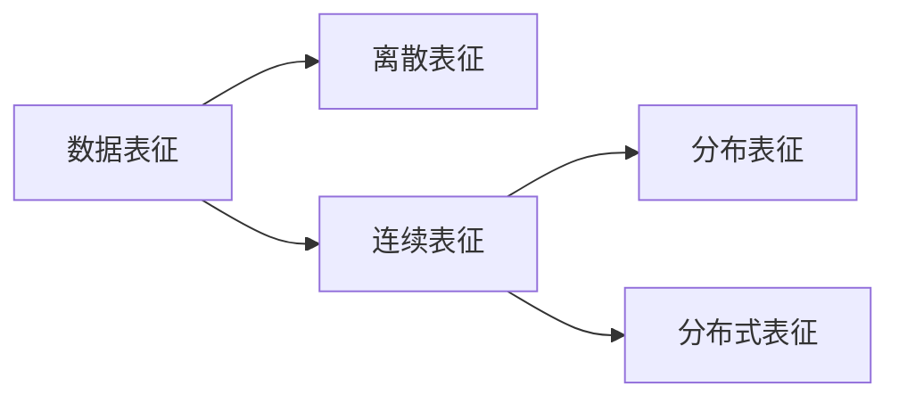

$$
\begin{align*}
\newcommand{\Hilbert}[1]{\mathscr{#1}}
\newcommand{\dd}{\operatorname{d}}
\newcommand{\op}{\hat}
\newcommand{\id}{\mathbf{I}}
\newcommand{\Tr}[1]{\operatorname{Tr}\left\lbrace#1\right\rbrace}
\newcommand{\realset}{\mathbb{R}}
\newcommand{\intset}{\mathbb Z }
\newcommand{\comset }{\mathbb C }
\newcommand{\innerproduct}[1]{\left\langle #1 \right\rangle}
\renewcommand{\vec}{\mathbf}
\newcommand{\spl}[1]{\langle{#1}\rangle}
\newcommand{\inner}[2]{\left\langle{#1,#2}\right\rangle}
\newcommand{\form}{\tilde}
\newcommand{\abs}[1]{\left\vert{#1}\right\vert}
\newcommand{\bra}[1]{\left\langle{#1}\right\vert }
\newcommand{\ket}[1]{\left| {#1}\right\rangle}
\newcommand{\braket}[2]{\left\langle {#1} \; \middle|\;{#2} \right\rangle }
\newcommand{\mani}{\mathcal}
\newcommand{\field}{\mathscr}
\newcommand{\Tspace}[1]{T\! {#1}}
\newcommand{\D}[2]{\frac{\d {#1}}{\d {#2} }}
\newcommand{\Partial}[2]{\frac{\partial {#1} }{\partial {#2} }}
\newcommand{\op}{\hat}
\newcommand{\uvec}{\hat}
\newcommand{\defas}{: =}
\newcommand{\isdefas}{= :}
\newcommand{\Eqn}[1]{\text{(Eqn. }\ref{#1}\text{)}}
\newcommand{\dual}{\tilde}
\newcommand{\vard}{\mathfrak{d}}
\newcommand{\vare}{\mathfrak{e}}
\newcommand{\e}{\mathrm{e}}
\newcommand{\ii}{\mathrm{i}}
\newcommand{\blue}{\color{blue}}
\newcommand{\red}{\color{red}}
\newcommand{\norm}[1]{\left\|{#1}\right\|}
\newcommand{\set}[1]{\left\lbrace{#1}\right\rbrace}
\newcommand{\sgn}{\operatorname{sgn}}
\newcommand\myeq{\stackrel{\mbox{adiabatic}}{=}}
\newcommand{\avg}[1]{\left\langle {#1} \right\rangle}
\end{align*}
$$

今天读的文章是发表在《计算机科学》上的《复杂异构数据的表征学习综述》，作者来自国防科技大学计算机系。知模型先知数据结构。这篇文章是复杂数据结构类很好的综述性文章，故作此摘要。

- 离散表征即将数据按离散值表示，一般只是将数据符号化，而不含有任何的语义信息，如one-hot encoding。

> 经典的机器学习算法, 如传统聚类、 高斯混合模型、 最近邻方法、 决策树等, 都是基于这样的表征. 例如, 在经典聚类算法kmeans 聚类中, 数据对象的类别由最近的一个中心点指定, 这个类别的表征就是典型的离散表征。 

- 分布表征基于分布假设, 利用数据的概率分布来表征数据。分布表征在文本表征中较为常见，如潜在语义分析
  模型、潜在狄利克雷分配模型等。   

>基于分布表征的学习模型一般是生成式模型, 即求观测数据变量和目标变量的联合概率分布。通常该模型一般有很强的假设, 且模型的求解或推断较为复杂。

- 分布式表征是指将数据嵌入到低维连续空间，学习嵌入的常用方法是神经网络，如NLP中的word2vec，复杂网络中的node2vec等。

Complex data structures: high dimensions, heterogeneity, multi-source, multi-level, multi-task

##### References

