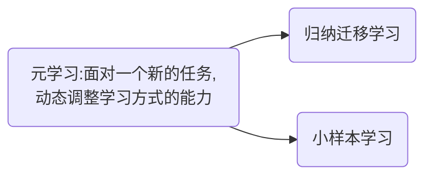

$$
\begin{align*}
\newcommand{\Hilbert}[1]{\mathscr{#1}}
\newcommand{\dd}{\operatorname{d}}
\newcommand{\op}{\hat}
\newcommand{\id}{\mathbf{I}}
\newcommand{\Tr}[1]{\operatorname{Tr}\left\lbrace#1\right\rbrace}
\newcommand{\realset}{\mathbb{R}}
\newcommand{\intset}{\mathbb Z }
\newcommand{\comset }{\mathbb C }
\newcommand{\innerproduct}[1]{\left\langle #1 \right\rangle}
\renewcommand{\vec}{\mathbf}
\newcommand{\spl}[1]{\langle{#1}\rangle}
\newcommand{\inner}[2]{\left\langle{#1,#2}\right\rangle}
\newcommand{\form}{\tilde}
\newcommand{\abs}[1]{\left\vert{#1}\right\vert}
\newcommand{\bra}[1]{\left\langle{#1}\right\vert }
\newcommand{\ket}[1]{\left| {#1}\right\rangle}
\newcommand{\braket}[2]{\left\langle {#1} \; \middle|\;{#2} \right\rangle }
\newcommand{\mani}{\mathcal}
\newcommand{\field}{\mathscr}
\newcommand{\Tspace}[1]{T\! {#1}}
\newcommand{\D}[2]{\frac{\d {#1}}{\d {#2} }}
\newcommand{\Partial}[2]{\frac{\partial {#1} }{\partial {#2} }}
\newcommand{\op}{\hat}
\newcommand{\uvec}{\hat}
\newcommand{\defas}{: =}
\newcommand{\isdefas}{= :}
\newcommand{\Eqn}[1]{\text{(Eqn. }\ref{#1}\text{)}}
\newcommand{\dual}{\tilde}
\newcommand{\vard}{\mathfrak{d}}
\newcommand{\vare}{\mathfrak{e}}
\newcommand{\e}{\mathrm{e}}
\newcommand{\ii}{\mathrm{i}}
\newcommand{\blue}{\color{blue}}
\newcommand{\red}{\color{red}}
\newcommand{\norm}[1]{\left\|{#1}\right\|}
\newcommand{\set}[1]{\left\lbrace{#1}\right\rbrace}
\newcommand{\sgn}{\operatorname{sgn}}
\newcommand\myeq{\stackrel{\mbox{adiabatic}}{=}}
\newcommand{\avg}[1]{\left\langle {#1} \right\rangle}
\end{align*}
$$

### 元学习

**“元学习的目标之一是快速学习的能力， 即在多个不同的任务上学习一个模型， 让其在新任务上经过少量的迭代， 甚至是单步迭代， 就可以达到一个非常好的性能， 并且避免在新任务上的过拟合。”**

`Thm` “没有免费午餐定理”：*没有一种通用的学习算法可以在所有任务上都有效*

相比归纳迁移学习，元学习更侧重从多种不同(甚至不相关)的任务中归纳出一种学习方法；

小样本学习：每个类只有$K$个标注样本，$K$非常小

##### 基于优化器的元学习

自动学习一种更新参数的规则，通过另一个神经网络来建模梯度下降的过程

$\mathcal{L}(\theta)$为目标函数，每步迭代的目标是$\mathcal{L}(\theta)$最小。学习优化器$g_{t}(\cdot)$的过程可以看作元学习，其目标是找到一个适用
于多个不同任务的优化器，$\mathcal{L}(\phi)$为元学习的损失函数。
$$
\begin{aligned} \mathcal{L}(\phi) &=\mathbb{E}_{f}\left[\sum_{t=1}^{T} w_{t} \mathcal{L}\left(\theta_{t}\right)\right] \\ \theta_{t} &=\theta_{t-1}+g_{t} \\\left[\boldsymbol{g}_{t} ; \boldsymbol{h}_{t}\right] &=\operatorname{LSTM}\left(\nabla \mathcal{L}\left(\theta_{t-1}\right), \boldsymbol{h}_{t-1} ; \phi\right) \end{aligned}
$$
$t,T$都是代表迭代步数，$w_{t}$代表每一次迭代的权重，使用LSTM 网络记忆梯度的历史信息 。在每步训练时， 随机初始化模型参数，计算每一步的$\mathcal{L}(\theta_t)$，以及元学习的损失函数$\mathcal{L}(\phi)$，所有参数使用一个共享的LSTM网络进行梯度下降来更新。

##### 与模型无关的元学习(MAML)

假设所有的任务都来自于一个任务空间，其分布为$p(\mathcal{T})$，我们可以在这个任务空间的所有任务上学习一种通用的表示， 这种表示可以经过梯度下降方法在一个特定的单任务上进行精调。 

MAML的算法如下：

先对所有任务上的元优化采用梯度下降进行优化：
$$
\begin{split}
\theta &\leftarrow \theta-\beta \nabla_{\theta} \sum_{m=1}^{M} \mathcal{L}_{\mathcal{T}_{m}}\left(f_{\theta_{m}^{\prime}}\right)\\
&=\theta-\beta \sum_{m=1}^{M} \nabla_{\theta} \mathcal{L}_{\mathcal{T}_{m}}\left(f_{\theta_{m}}\right)\left(I-\alpha \nabla_{\theta}^{2} \mathcal{L}_{\mathcal{T}_{m}}\left(f_{\theta_{m}}\right)\right)
\end{split}
$$

##### References

