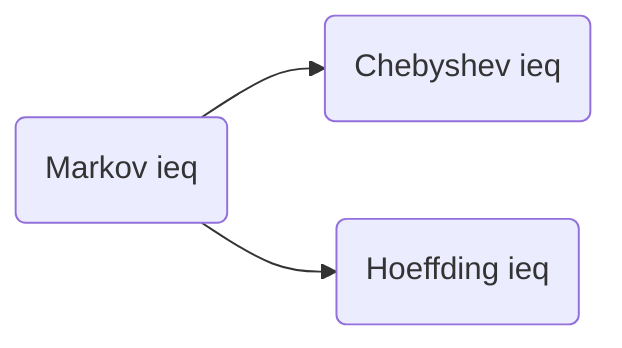

#### Numeric inequality

$$
1+x\leq e^x
$$

the most we may expect from a concentration inequality is that the tail of $\sum a_{i} X_{i}$ behaves similarly to the tail of the normal distribution.  And for all practical purposes, Hoeffding’s tail bound does that.   

#### Markov inequality

#### Hoeffding’s inequality

$X_1\cdots X_N$ are i.i.d symmetric Bernoulli r.v, $a=(a_1\cdots a_N)\in\mathbb{R}^N$ . For any $t\geq 0$ ,

$$
\mathbb{P}(\sum_{i=1}^N a_iX_i\geq t)\leq \exp(-\frac{t^2}{2\|a\|^2_2})
$$

`Proof` : Trick: multiply a fixed parameter $\lambda >0$ and exponentiate, then use the Markov inequality

Hoeffding 不等式在非渐近的情况下，对有限的 $N$ 成立。这种非渐近性使它在数据科学的应用中非常受欢迎，在应用中 $N$ 一般为样本数。

双边Hoeffding不等式的推导：利用对称伯努利变量的对称性，对 $-X$ 应用Hoeffding不等式得到 $P(-S\geq t)$ ，由 $\mathbb{P}\{|S| \geq t\}=\mathbb{P}\{S \geq t\}+\mathbb{P}\{-S \geq t\}$ (两者的和事件为空) 可以得到双侧的Hoeffding不等式 $P(|S|\geq t)$ :

$$
\mathbb{P}\left\{\left|\sum_{i=1}^{N} a_{i} X_{i}\right| \geq t\right\} \leq \textcolor{red}{2}\exp \left(-\frac{t^{2}}{2\|a\|_{2}^{2}}\right)
$$

